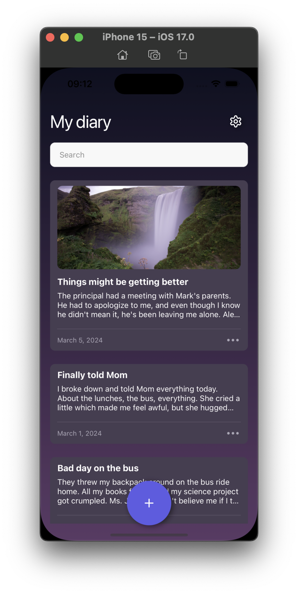
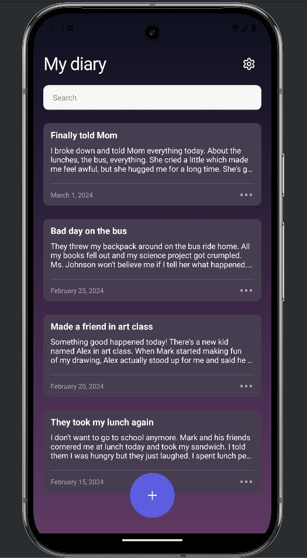
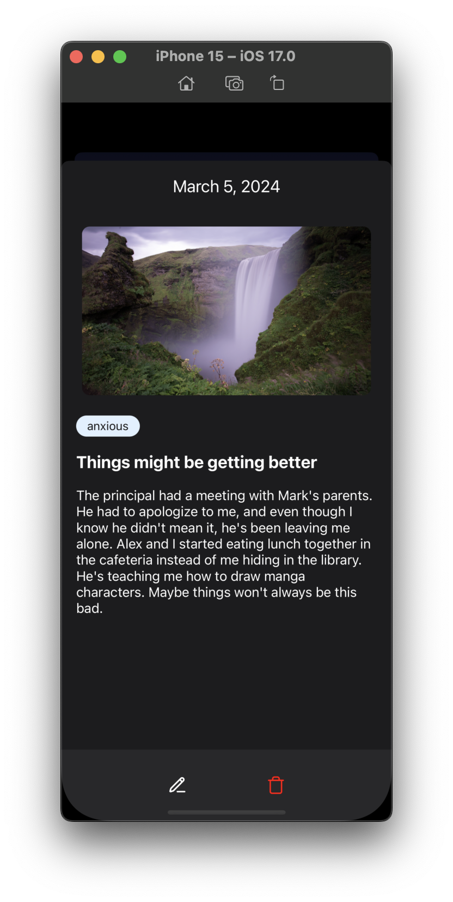
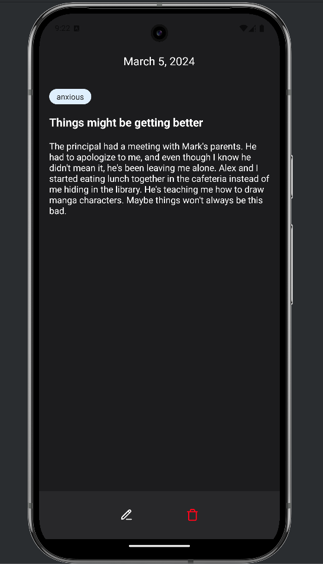
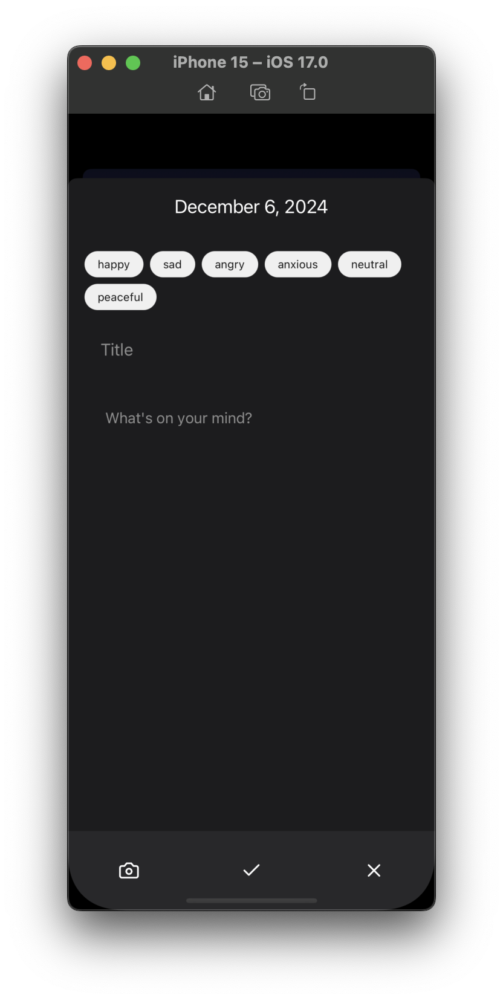
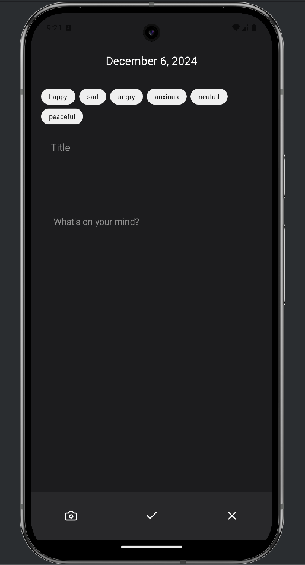
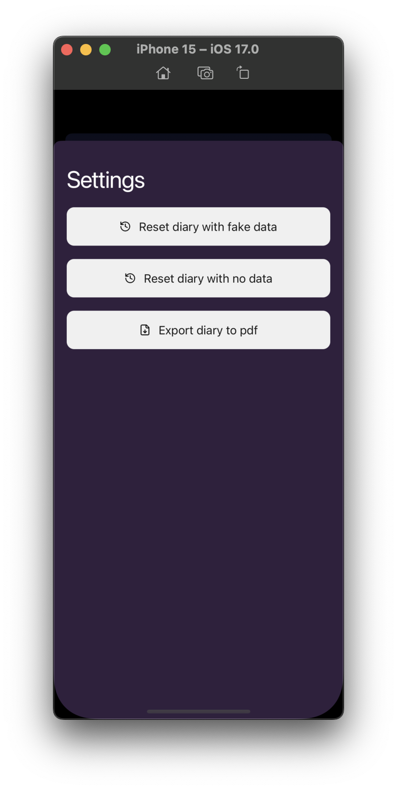
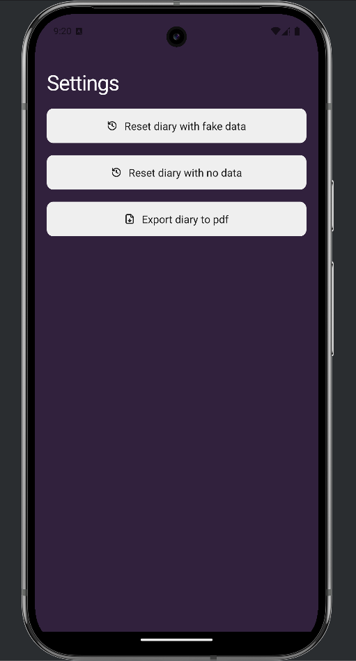

# Diary test app

## Description

This is a small diary app built with Expo and Tamagui made for a technical interview.

## Get started

1. Install dependencies

   ```bash
   npm install
   ```

2. Build the app.

   ```bash
   npx expo run:android
   npx expo run:ios
   ```

   These commands will build the native app for Android and iOS. Run it every time you add a new native dependency or when you want to install the app on a new device.

3. Start the app by launching the Metro bundler

   ```bash
   npm start
   ```

> Warning: This app does not work on with Expo GO, step 2 is required.

## Features

- [x] Add a new diary entry with a title, content.
- [x] View all diary entries.
- [x] View a single diary entry.
- [x] Edit a diary entry.
- [x] Delete a diary entry.
- [x] Add labels to a diary entry.
- [x] Filter diary entries by content or title.
- [x] Add an image to a diary entry.
- [x] Export to PDF and share
- [x] Add a video to a diary entry and play it.
- [ ] Add audio notes (TODO)
- [ ] Add icon & splash screen (TODO)
- [ ] Add animations (TODO)

## Remaining tasks

- [ ] Use tamagui theme properly for colors
- [ ] Fix bug when keyboard is open
- [ ] Display modals properly on android

## Screenshots & videos

Video of the app in on iOS simulator:

https://github.com/user-attachments/assets/8c77b64d-ef96-4aba-bc2b-5fd910614a3e

https://github.com/user-attachments/assets/85959f39-785c-40cb-9412-cf127723d7de

https://github.com/user-attachments/assets/46fd4425-bdd6-41b1-aeca-c7f1a5aec885

| Page             | iOS                                               | Android                                                   |
| ---------------- | ------------------------------------------------- | --------------------------------------------------------- |
| Homepage         |        |        |
| Diary Entry Page |  |  |
| New Entry Page   |  |  |
| Settings Page    |    |    |
